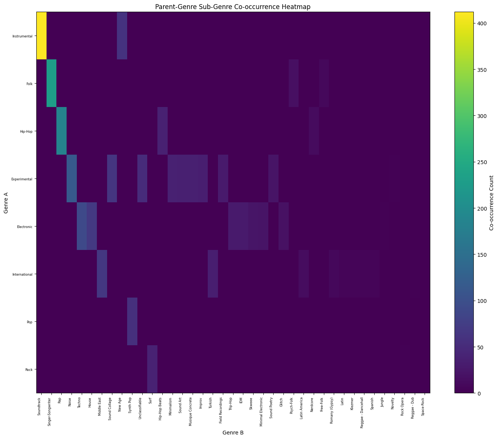
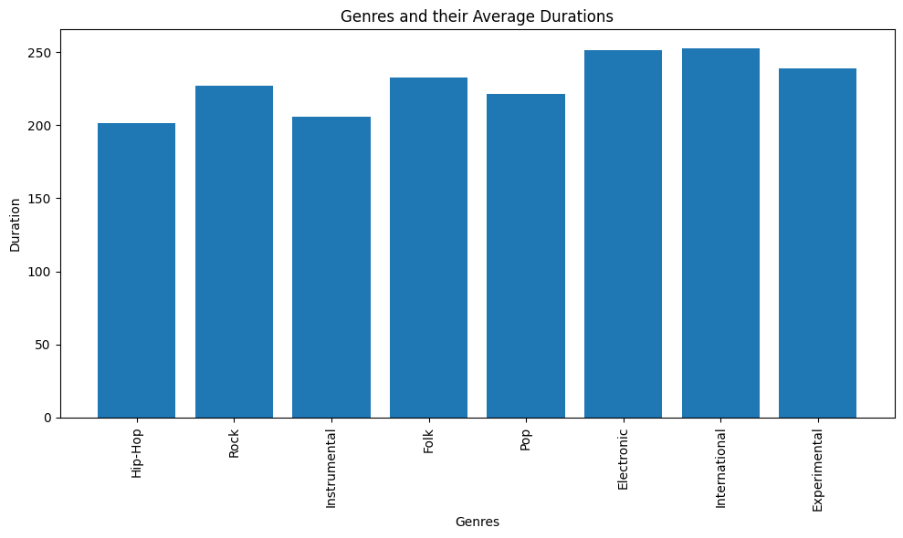

# Fine-Tuning Music2Vec for Genre Classification on FMA

This project fine-tunes Facebook AI's [msuic2vec] model for **music genre classification** using the [FMA (Free Music Archive)](https://github.com/mdeff/fma) dataset. The model operates directly on raw audio waveforms and classifies tracks into genres such as **rock**, **jazz**, **hip-hop**, and more. This project was developed as part of the *Deep Learning* course in the MSc in Computer Science program at the **Athens University of Economics and Business**, during the **Spring Semester of 2025**.


## Key Features

- Fine-tunes a Music2Vec 2.0 model on raw waveform data
- Supports training, evaluation, prediction, and genre manipulation
- Full experiment tracking with **Weights & Biases**
- Evaluation with **scikit-learn** classification metrics

---

## Project Structure

```
.
├── config.yaml               # Configuration file
├── entrypoints.py            # CLI commands for all core tasks
├── trainer/
│   └── train.py              # Training loop
├── inference/
│   ├── test.py               # Test loop
│   ├── predict.py            # Predict a genre from a single song
│   └── song_distortion.py    # Distort a song toward a specific genre
├── dataset/
|   └── dataset.py            # Torch Dataset class for the FMA dataset
├── model/
│   └── model.py              # The model base class
├── factories/
│    ├── dataloader.py        # The factory for the DataLoader
│    ├── loss.py              # The loss factory
│    └── optimizer.py         # Optimizer and Scheduler factory
├── eda
│   ├── all_genres_per_sample.ipynb
│   ├── average_duration.ipynb
│   ├── create_mapping.ipynb
│   ├── cross_appearance.ipynb
│   ├── genre_top_per_sample.ipynb
│   └── process_tracks_csv.ipynb
├── utils/
│    ├── audio_utils.py       # Audio utilities
│    ├── corrupt_files.py     # Checks for corrupted files
│    └── seed.py              # Random seed function
├── requirements.txt
└── report.pdf
```

---

## Exploratory Data Analysis 

To better understand the relationships between genres, we performed an exploratory data analysis (EDA) on the dataset. 

- Co-occurence matrix

- Sample count per duration

- Average duration per genre



## Setup

### 1. Create and activate virtual environment

```bash
python3 -m venv .venv
source .venv/bin/activate   # On Windows use: .venv\Scripts\activate
```

### 2. Install dependencies

```bash
pip install -r requirements.txt
```

---

## Data and Model Weights

- **Dataset CSVs**: [Download CSVs (train, val, test)](https://your-dataset-link.com)
- **Model Weights**: [Pretrained model checkpoint](https://your-model-weights-link.com)

Ensure your `config.yaml` points to the correct CSVs and checkpoint paths.

---

## How to Use

All functionality is handled via the `entrypoints.py` command-line interface.

### Train the Model

```bash
python entrypoints.py initiate_training --config_path=config.yaml
```

Starts training using the configuration provided. Logs training and validation metrics to **WandB** and saves the best model checkpoint.
If you don't have a wandb account set the logging in the config file equal to `None`.


---

### Test the Model

```bash
python entrypoints.py initiate_testing --config_path=config.yaml
```

Evaluates the model on the `test.csv` split, calculates `accuracy`, `precision`, `recall`, and `F1` using `sklearn`, and logs results to **WandB** under the `"test"` section.s

---

### Predict Genre for a Single Song

```bash
python entrypoints.py inference_song --song=path/to/song.wav
```

Predicts the genre of a raw audio file. The audio is automatically:
- Resampled to **16kHz**
- Converted to **mono**
- Passed through the ONNX model for inference

---

### Distort Songs Toward "Rock"

```bash
python entrypoints.py distort_songs --songs=path/to/song/folder/
```

Applies genre manipulation logic to nudge audio samples toward the **rock** genre. Implementation in `inference/song_distortion.py`.

---

## Metrics Logged

During testing, the following metrics are logged via **Weights & Biases**:

- Accuracy
- Precision (weighted)
- Recall (weighted)
- F1 Score (weighted)
- Full `classification_report` from `sklearn`

## Contributing

Pull requests are welcome. For major changes, please open an issue first to discuss what you'd like to improve.

---

## Contact

For questions, feedback, or collaboration inquiries, feel free to open an issue or reach out via email:

- 📧 [sta.armeniakos@aueb.gr](mailto:sta.armeniakos@aueb.gr)
- 📧 [fot.bistas@aueb.gr](mailto:fot.bistas@aueb.gr)

---
